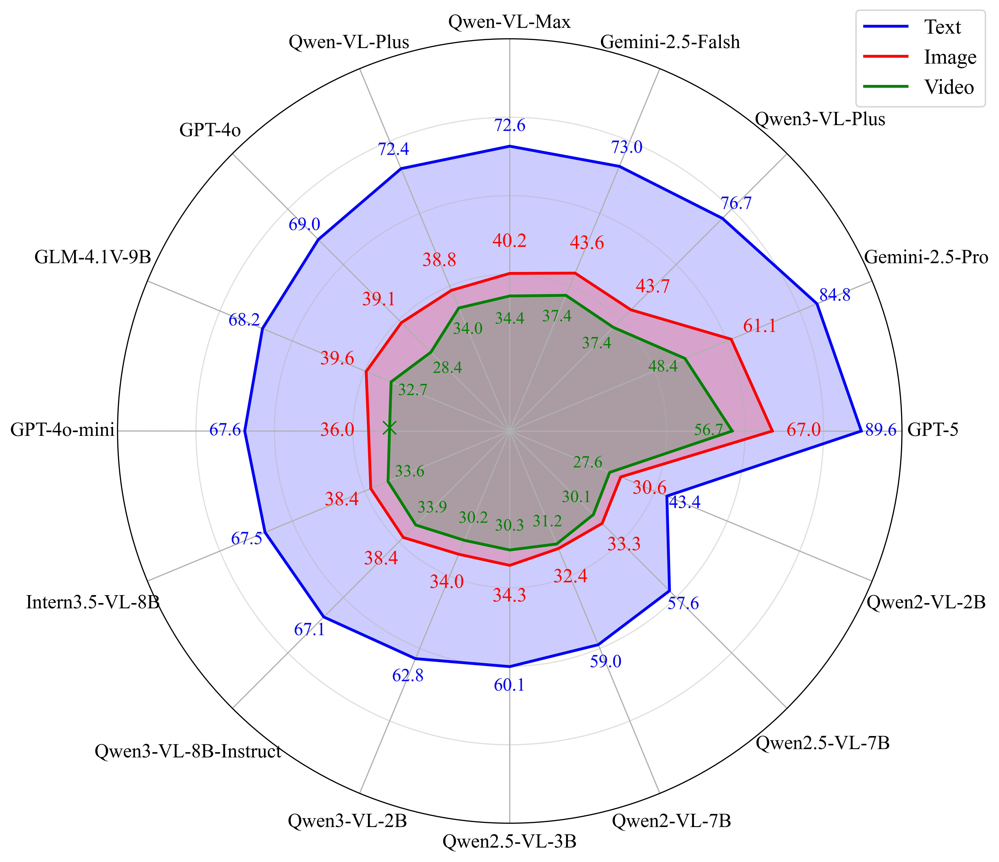
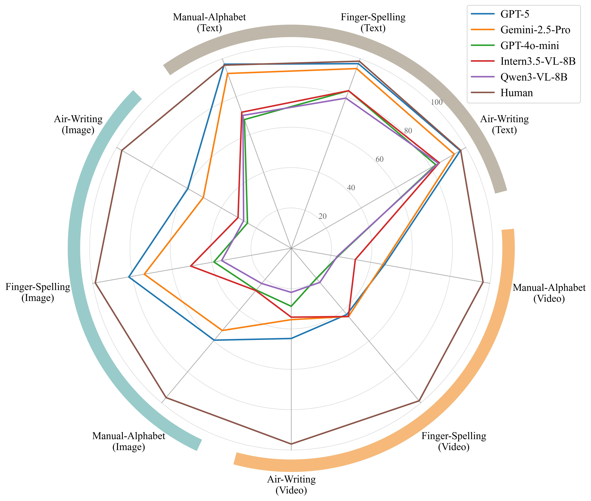

# CNSL-bench: Benchmarking Sign Language Understanding in MLLMs

[Paper](./CNSL-bench.pdf) | Dataset Coming Soon | Results Coming Soon

CNSL-bench is a Chinese National Sign Language benchmark for evaluating the intrinsic sign language understanding ability of multimodal large language models (MLLMs). It is built from the **National Common Sign Language Dictionary** and contains aligned text descriptions, illustrative images, and sign-language videos.

## News

- CNSL-bench has been accepted to the ACL main conference.
- The paper PDF is available in this repository.
- The full benchmark data will be released after the copyright-sensitive media files are cleared.

## Motivation

Current MLLMs have strong general image and video understanding ability, but their sign language understanding remains underexplored. CNSL-bench provides a controlled four-choice evaluation setting for Chinese National Sign Language, covering text, image, and video inputs.

The benchmark also supports analysis of fine-grained manual articulatory forms, including air-writing, finger-spelling, and the Chinese manual-alphabet.

## Statistics

| Item | Count |
| --- | ---: |
| Original sign glosses | 8,214 |
| Unique sign entries after preprocessing | 6,707 |
| Evaluation instances across text/image/video | 20,121 |
| Air-writing entries | 407 |
| Finger-spelling entries | 77 |
| Manual-alphabet entries | 592 |

## Dataset

Each example is a multiple-choice question. The model receives one modality input and selects the correct sign meaning from four options.

- Text: sign descriptions.
- Image: illustrative sign images.
- Video: isolated sign-language videos.

A toy JSONL example is provided in [data/examples/sample_questions.jsonl](./data/examples/sample_questions.jsonl):

```json
{
  "id": "example_id",
  "gloss": "sign language",
  "modality": "image",
  "input": "path_or_reference_to_input",
  "question": "What is the meaning of the sign?",
  "options": {
    "A": "compute",
    "B": "sign language",
    "C": "language",
    "D": "school"
  },
  "answer": "B",
  "category": {
    "air_writing": false,
    "finger_spelling": false,
    "manual_alphabet": false
  }
}
```

Full media-bearing files are not included in this git repository yet. Placeholder folders are kept under [data/placeholders](./data/placeholders/) for the future release.

## Evaluation

The main metric is multiple-choice accuracy. We report results by:

- modality: text, image, and video;
- subset: air-writing, finger-spelling, manual-alphabet, and other signs;
- model family: open-source models, proprietary models, and human performance.

The following figures summarize the main findings from the paper: current MLLMs perform much better on textual sign descriptions than on visual sign inputs, and a clear gap remains between MLLMs and human sign-language understanding across fine-grained articulatory subsets.





### Result Format

Model-level summaries can follow this CSV schema:

```csv
model,model_type,modality,subset,accuracy,num_instances,notes
Example-MLLM,open-source,text,overall,,,
Example-MLLM,open-source,image,overall,,,
Example-MLLM,open-source,video,overall,,,
Human,human,all,overall,,,
```

## File Structure

```text
CNSL-bench
|-- assets/              # Public figures
|-- data/                # Dataset schema, examples, and placeholders
|-- CNSL-bench.pdf       # Paper
|-- CITATION.cff
|-- LICENSE
`-- README.md
```

## Reference

If you find CNSL-bench useful, please cite our paper:

```bibtex
@inproceedings{zhao-etal-cnsl-bench,
  title = {{CNSL-bench}: Benchmarking the Sign Language Understanding Capabilities of {MLLMs} on Chinese National Sign Language},
  author = {Zhao, Rui and Zhong, Xuewen and Zheng, Xiaoyun and Su, Jinsong and Chen, Yidong},
  booktitle = {Proceedings of the Annual Meeting of the Association for Computational Linguistics},
  year = {2026}
}
```

The citation will be updated after the official ACL proceedings metadata is released.

## Contact

For questions about CNSL-bench, please contact:

- Rui Zhao: zhsqzr@stu.xmu.edu.cn
- Yidong Chen: ydchen@xmu.edu.cn
