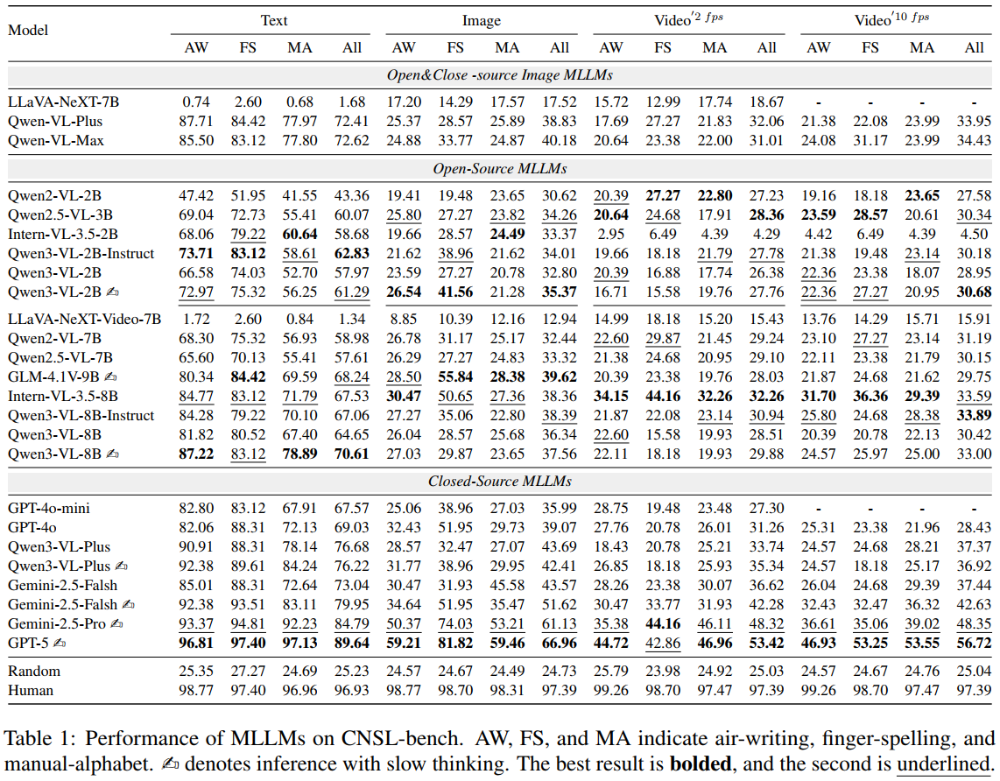

# CNSL-bench: Benchmarking Sign Language Understanding in MLLMs

[arXiv](https://arxiv.org/abs/2604.22367) | [Paper PDF](./CNSL-bench.pdf) | [Dataset](./data/) | [Results](#main-results) | [License](./LICENSE)

CNSL-bench is a benchmark for evaluating the intrinsic Chinese National Sign Language understanding ability of multimodal large language models (MLLMs). It uses controlled four-choice tasks across text, image, and video inputs, with additional analysis of fine-grained articulatory forms.

The benchmark is built by aligning glosses, textual descriptions, and illustrations from the **National Common Sign Language Dictionary** with isolated sign-language videos from **CNSL-DP**.

## News

- CNSL-bench has been accepted to the ACL 2026 main conference.
- The paper is available on [arXiv](https://arxiv.org/abs/2604.22367) and as a [local PDF](./CNSL-bench.pdf).
- The public release includes 6,707 aligned metadata records, all textual descriptions, five image examples, and five processed video examples.
- Main evaluation results for text, image, and video inputs are available [below](#main-results).

## Evaluation Results

CNSL-bench evaluates each aligned entry with text, image, and video inputs. Video performance is reported at sampling rates of 2 fps and 10 fps. Results are broken down into:

- **AW:** Air-writing.
- **FS:** Finger-spelling.
- **MA:** Manual alphabet.
- **All:** The complete evaluation set for the corresponding modality.


### Summary Figures

Current MLLMs perform substantially better on textual descriptions than on image and video inputs. A clear gap remains between model and human performance, especially for visual sign-language understanding and fine-grained articulatory subsets.

<table>
  <tr>
    <td></td>
    <td></td>
  </tr>
  <tr>
    <td align="center">Overall performance by modality.</td>
    <td align="center">Performance on fine-grained subsets.</td>
  </tr>
</table>

### Main Results

The figure reports accuracy (%) for open-source and closed-source MLLMs, random selection, and human performance. The symbol beside selected model names denotes inference with slow thinking; bold and underlined values indicate the best and second-best results within the corresponding comparison group.



## Benchmark Overview

- **Task:** Select the correct sign meaning from four candidates.
- **Modalities:** Textual sign descriptions, illustrative sign images, and isolated sign-language videos.
- **Fine-grained subsets:** Air-writing, finger-spelling, and manual-alphabet signs.
- **Metric:** Multiple-choice accuracy, reported by modality, subset, model family, and human performance.

### Statistics

| Item | Count |
| --- | ---: |
| Original sign glosses | 8,214 |
| Unique sign entries after preprocessing | 6,707 |
| Evaluation instances across text, image, and video | 20,121 |
| Air-writing entries | 407 |
| Finger-spelling entries | 77 |
| Manual-alphabet entries | 592 |

## Dataset

### Public Metadata

[data/cnsl_bench.json](./data/cnsl_bench.json) contains 6,707 aligned records. Each record has five fields:

| Field | Description |
| --- | --- |
| `index` | Unique shared index for the metadata, image, and video. |
| `gloss` | Chinese National Sign Language gloss from the dictionary. |
| `description` | Textual description of the sign. |
| `image` | Image filename derived from the zero-padded index. |
| `video` | Video filename derived from the same zero-padded index. |

Example:

```json
{
  "index": 2728,
  "gloss": "阿昌族",
  "description": "（一）一手握拳，手背向外，先在左胸部捶一下，再在右胸部捶一下。 （二）一手五指张开，指尖朝上，然后撮合。",
  "image": "2728.jpg",
  "video": "2728.mp4"
}
```

The shared index connects records across the dictionary and CNSL-DP even when their original gloss annotations do not match exactly. Indices below 1000 are zero-padded in media filenames; for example, index `354` maps to `0354.jpg` and `0354.mp4`.

### Data Sources and Media Availability

- **Text:** All textual sign descriptions are included in `cnsl_bench.json`.
- **Images:** The illustrations originate from the National Common Sign Language Dictionary. Because of copyright restrictions, this repository includes only five examples. Access to the remaining images must be requested separately.
- **Videos:** The videos originate from CNSL-DP, introduced in *A Large Dataset Covering the Chinese National Sign Language for Dual-view Isolated Sign Language Recognition*. This repository includes five processed examples; the complete source videos must be requested from the CNSL-DP authors.

The included videos use the `front` view of signer `CSY`. Each original 1920 x 1080, 60 fps video is cropped around the signer to a 1080 x 1080 square, resized to 512 x 512, and converted to 24 fps. The directory name records this configuration:

```text
data/videos/CSY_front_in-1080x1080_out-512x512/
```

See [data/README.md](./data/README.md) for the complete schema, filename conventions, and data-access notes. A small set of toy multiple-choice records is provided in [data/examples/sample_questions.jsonl](./data/examples/sample_questions.jsonl) to illustrate the evaluation format; these records must not be used to report benchmark performance.


## Citation

If you use CNSL-bench, please cite our paper:

```bibtex
@inproceedings{zhao-etal-cnsl-bench,
  title = {{CNSL-bench}: Benchmarking the Sign Language Understanding Capabilities of {MLLMs} on Chinese National Sign Language},
  author = {Zhao, Rui and Zhong, Xuewen and Zheng, Xiaoyun and Su, Jinsong and Chen, Yidong},
  booktitle = {Proceedings of the Annual Meeting of the Association for Computational Linguistics},
  year = {2026}
}
```

The citation will be updated after the official ACL proceedings metadata is released. Machine-readable citation metadata is available in [CITATION.cff](./CITATION.cff).

## License and Data Use

Please review [LICENSE](./LICENSE) before using or redistributing this repository. Copyright-sensitive source media are not covered by the source-code license unless an explicit license is provided for those files. Users are responsible for following the access and reuse terms of the National Common Sign Language Dictionary and CNSL-DP.

## Contact

For questions about CNSL-bench or access to restricted materials, contact Rui Zhao at [zhsqzr@stu.xmu.edu.cn](mailto:zhsqzr@stu.xmu.edu.cn).
